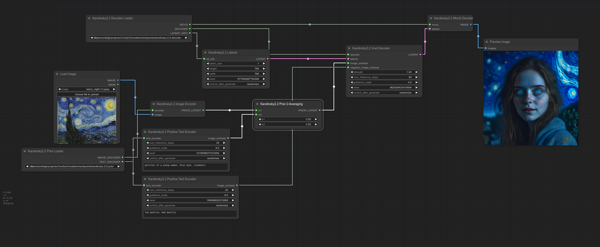
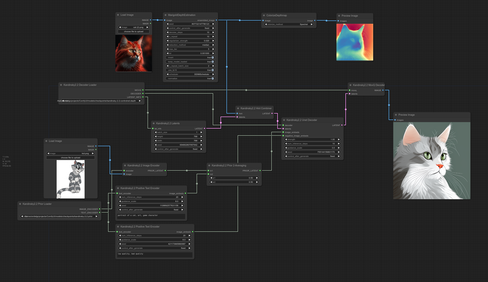

# Kandinsky 2.2 ComfUI Plugin


Use the models of Kandinsky 2.2 published on 🤗 HuggingFace.

## Features provided

Nodes provide an options to combine prior and decoder models of Kandinsky 2.2.

- Find priors for text and images
- Combine priors with weights
- Prepare latents only or latents based on image (see img2img workflow).
- Use depth hint computed by a separate node.

All weights can be found in Kandinsky Community on 🤗 HF for [Kandinsky 2.2 Collection](https://huggingface.co/collections/kandinsky-community/kandinsky-22-64f9d7de87c368f6184c73c9).

## Workflow Examples

- A simple text-based workflow ([source](workflows/workflow-simple.json)).


- A workflow based on image prior embeds ([source](workflows/workflow-image-embed.json))



- An Image-To-Image workflow ([source](workflows/workflow-img2img.json))


- A depth based workflow ([source](workflows/workflow-depth.json))



## Installation

For the easiest experience, install the [Comfyui Manager](https://github.com/ltdrdata/ComfyUI-Manager) and 
use that to automate the installation process. The repository is not included in the list at the moment, but 
you'll need **Marigold depth estimation**, that can be installed via manager.

To install this plugin, open the terminal, cd to `<ComfyUI>/custom_nodes`, and clone the repo:
```
git clone https://github.com/vsevolod-oparin/comfyui-kandinsky22
```

Install the requirements using:
```
python -s -m pip install -r requirements.txt
```

### Download Models

Go to `models/checkpoints` in ComfyUI directory and run the command
```
git clone --depth 1 <HF repository>
```
E.g. to download default pipeline run the following
```
git clone --depth 1 https://huggingface.co/kandinsky-community/kandinsky-2-2-decoder
git clone --depth 1 https://huggingface.co/kandinsky-community/kandinsky-2-2-prior
```

**Note 1**: Git won't show much of the progress. You'll need to wait till the model will be downloaded.
**Note 2**: `--depth` argument can be skipped, but you're risking to download a lot of unnecessary data.


## Acknowledgments

**A special thanks to:**

- The developers of [Kandinsky Model](https://github.com/ai-forever/Kandinsky-2?tab=readme-ov-file#authors). 
- Patrick Von Platent for moving Kandinsky to [diffusers](https://github.com/huggingface/diffusers/issues/4290).  
- Comfyanonamous and the rest of the [ComfyUI](https://github.com/comfyanonymous/ComfyUI/tree/master) contributors for a fantastic UI!
